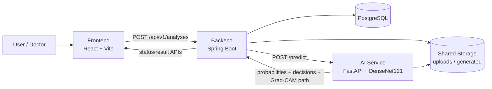

# MediScope: Chest X-ray Reading Assist System

> **Deep Learning-Based Chest X-ray Reading Assistance System using DenseNet121 and Grad-CAM**  
> 흉부 X-ray 영상에 대해 주요 이상 소견의 예측 확률, threshold 기반 양성/음성 판단, Grad-CAM 시각화 근거를 함께 제공하는 웹 기반 판독 보조 프로토타입입니다.

---

## Visual & Research References

### Service Architecture


### Result Summary & Grad-CAM


### Condition Details


### Paper & Presentation

| Type | File |
|---|---|
| Paper | [`docs/research/mediscope-kit-2026-paper.hwp`](docs/research/mediscope-kit-2026-paper.hwp) |
| Presentation | [`docs/research/mediscope-final-presentation.pptx`](docs/research/mediscope-final-presentation.pptx) |

---

## 1. Project Overview

**MediScope**는 흉부 X-ray 판독 과정에서 발생할 수 있는 업무 부담, 병변 확인 어려움, 모델 결과 해석 문제를 보조하기 위해 만든 **AI 기반 흉부 X-ray 판독 보조 웹 서비스형 프로토타입**입니다.

사용자는 흉부 X-ray 이미지를 업로드하고, 시스템은 다음 결과를 제공합니다.

- 5개 주요 흉부 이상 소견별 예측 확률
- 병변별 threshold 기반 양성/음성 판단
- 병변별 설명 및 X-ray 확인 포인트
- Grad-CAM 기반 시각적 근거 영상
- 원본 X-ray와 Grad-CAM 결과 비교 화면
- 분석 상태, 결과, 생성 artifact를 관리하는 end-to-end 서비스 흐름

> 본 프로젝트는 연구 및 교육 목적의 판독 보조 프로토타입이며, 의료진의 최종 진단을 대체하지 않습니다.

---

## 2. Problem & Motivation

흉부 X-ray는 의료 현장에서 널리 사용되는 기본 영상 검사이지만, 3차원 해부학적 구조가 2차원 영상에 중첩되어 나타나기 때문에 작은 병변이나 구조물에 가려진 이상 소견은 판독 과정에서 놓칠 수 있습니다. 또한 검사량 증가로 인해 영상의학과 판독 업무량이 커지고 있으며, AI 기반 판독 보조 시스템은 정상/이상 소견 선별, 판독 우선순위 설정, 시각적 근거 제공 측면에서 활용 가능성이 있습니다.

MediScope는 단순 분류 모델이 아니라, **모델 예측 결과를 실제 서비스 흐름에서 보여주는 제품형 구조**를 목표로 했습니다.

---

## 3. Key Features

### Image Upload & Analysis Request

- PNG/JPEG 흉부 X-ray 이미지 업로드
- 업로드 이미지 미리보기
- 분석 요청 생성 및 상태 관리
- 분석 ID 기반 결과 조회

### Multi-label Chest X-ray Classification

- CheXpert-small 기반 학습
- DenseNet121 backbone 사용
- sigmoid 기반 병변별 독립 확률 산출
- 5개 주요 흉부 이상 소견 대상 다중 라벨 분류

| Label | Korean Name |
|---|---|
| Atelectasis | 무기폐 |
| Cardiomegaly | 심비대 |
| Consolidation | 폐경화 |
| Edema | 폐부종 |
| Pleural Effusion | 흉막삼출 |

### Threshold-based Decision

검증 데이터셋에서 병변별 F1-score가 가장 높은 threshold를 선택하여 최종 양성/음성 판단에 사용합니다.

| Label | Threshold |
|---|---:|
| Atelectasis | 0.46 |
| Cardiomegaly | 0.11 |
| Consolidation | 0.47 |
| Edema | 0.34 |
| Pleural Effusion | 0.37 |

### Grad-CAM Explainability

- 모델이 예측에 상대적으로 많이 참고한 영역을 heatmap으로 시각화
- 원본 X-ray와 Grad-CAM 결과를 나란히 제공
- Grad-CAM은 진단 자체가 아니라 판독자가 확인할 후보 영역을 제시하는 보조 정보로 사용

### Product-style Result Dashboard

- 분석 결과 요약
- 가장 높은 확률 소견 표시
- 양성 병변 개수 표시
- 병변별 확률 카드
- 병변별 임상적 의미, X-ray 확인 포인트, AI 결과 해석 가이드 제공

---

## 4. System Architecture

MediScope는 연구용 모델 개발 흐름과 실제 서비스 흐름을 분리했습니다.

### Research Pipeline

- CheXpert-small 데이터셋 수집 및 train/valid/test split
- frontal view 기반 전처리
- DenseNet121 학습
- AUROC/AUPRC 평가
- threshold tuning
- Grad-CAM 시각화 검증
- inference artifact export

### Service Pipeline

- **Frontend**: 이미지 업로드, 미리보기, 결과 렌더링
- **Backend**: 분석 요청 생성, 상태/결과 API 제공, DB 관리, AI 서비스 호출
- **AI Service**: 전처리, 모델 추론, threshold 적용, Grad-CAM 생성
- **PostgreSQL**: 사용자, 이미지, 예측 결과, 분석 상태 저장
- **Shared Storage**: 업로드 이미지와 생성 artifact 저장



### Key Service Boundaries

| Boundary | Rule |
|---|---|
| User → Frontend | 사용자는 웹 UI만 사용 |
| Frontend → Backend | 모든 분석 요청은 Backend API로 전달 |
| Backend → AI Service | Backend가 AI Service `/predict` 호출 |
| AI Service → Storage | AI Service가 Grad-CAM artifact 생성 |
| User → AI Service | 직접 접근 없음 |

---

## 5. Tech Stack

| Area | Stack |
|---|---|
| Frontend | React, Vite, JavaScript, CSS |
| Backend | Spring Boot, Java, Gradle |
| AI Service | FastAPI, Python, PyTorch, torchvision |
| Model | DenseNet121, BCEWithLogitsLoss, Grad-CAM |
| Database | PostgreSQL |
| Infra | Docker Compose, shared volume |

---

## 6. Repository Structure

```text
capstone-cxr/
├── apps/
│   ├── frontend/        # React/Vite web client
│   ├── backend/         # Spring Boot API server
│   └── ai-service/      # FastAPI inference service
├── docs/
│   ├── api/             # API docs and reports
│   └── assets/          # README / paper images
├── infra/
│   └── compose/         # Docker Compose files
├── shared/
│   ├── uploads/         # uploaded X-ray images; local only
│   └── generated/       # Grad-CAM/result artifacts; local only
└── README.md
```

---

## 7. Model & Experiment Summary

### Training Setup

| Item | Setting |
|---|---|
| Dataset | CheXpert-small |
| View | Frontal view only |
| Target labels | Official 5 labels |
| Model | DenseNet121 |
| Task | Multi-label classification |
| Input size | 320×320 |
| Batch size | 32 |
| Epochs | 10 |
| Optimizer | Adam, lr=1e-4 |
| Loss | BCEWithLogitsLoss + pos_weight |
| Metrics | AUROC, AUPRC |
| Threshold tuning | F1 grid search, 0.05–0.95 |

### Uncertain Label Policy Comparison

| Policy | Valid AUROC | Valid AUPRC | Test AUROC | Test AUPRC | Note |
|---|---:|---:|---:|---:|---|
| U-Ignore | 0.8817 | 0.7387 | 0.8927 | 0.6494 | Representative policy |
| U-Ones | 0.8778 | 0.7216 | 0.8715 | 0.6116 | Lower performance |
| U-Zeros | 0.8837 | 0.7302 | 0.8903 | 0.6597 | Highest AUPRC, similar AUROC |

U-Ignore was selected as the representative policy because it achieved the highest test AUROC while avoiding forced positive/negative assignment for uncertain labels.

---

## 8. API Overview

### Backend API

| Method | Endpoint | Description |
|---|---|---|
| POST | `/api/v1/analyses` | X-ray 이미지 업로드 및 분석 요청 생성 |
| GET | `/api/v1/analyses/{analysisId}` | 분석 상태 조회 |
| GET | `/api/v1/analyses/{analysisId}/result` | 분석 결과 조회 |
| GET | `/api/v1/files/{analysisId}/original` | 원본 이미지 조회 |
| GET | `/api/v1/files/{analysisId}/gradcam` | Grad-CAM 이미지 조회 |

### AI Service API

| Method | Endpoint | Description |
|---|---|---|
| GET | `/health` | AI service health check |
| GET | `/version` | AI service version |
| POST | `/predict` | 이미지 경로 기반 추론 및 Grad-CAM 생성 |

---

## 9. Local Development

### Prerequisites

- Docker Desktop
- Node.js 20+
- Java 21+
- Python 3.11+
- Gradle wrapper

### Run with Docker Compose

```bash
cd ~/projects/capstone-cxr

docker compose -f infra/compose/docker-compose.dev.yml up -d
```

Health check:

```bash
curl -i http://localhost:8000/health
curl -i http://localhost:8000/version
curl -i http://localhost:8080/api/hello
curl -I http://localhost:5173
```

### Recommended Development Mode

For frontend-heavy work, run backend/AI/database with Docker and run the frontend locally with Vite.

```bash
cd ~/projects/capstone-cxr

docker compose -f infra/compose/docker-compose.dev.yml up -d postgres backend ai-service
```

```bash
cd apps/frontend
npm install
npm run dev
```

Frontend:

```text
http://localhost:5173
```

### Rebuild Only One Service

Frontend only:

```bash
docker compose -f infra/compose/docker-compose.dev.yml up -d --no-deps --build frontend
```

Backend only:

```bash
docker compose -f infra/compose/docker-compose.dev.yml up -d --no-deps --build backend
```

AI service only:

```bash
docker compose -f infra/compose/docker-compose.dev.yml up -d --no-deps --build ai-service
```

> AI service image can be heavy because it includes PyTorch. Avoid full rebuilds unless necessary.

---

## 10. Demo Flow

1. Open the frontend page.
2. Upload a chest X-ray image.
3. Click analysis start.
4. Backend creates an analysis request and stores the uploaded image.
5. Backend calls the AI service `/predict` endpoint.
6. AI service performs preprocessing, inference, thresholding, and Grad-CAM generation.
7. Frontend renders prediction summary, condition probabilities, original image, and Grad-CAM evidence map.

---

## 11. Team & Responsibilities

| Name | Role | Responsibility |
|---|---|---|
| 박용민 | Team Leader, AI Lead | Project coordination, model pipeline, AI service integration, experiment documentation |
| 하윤진 | Frontend Lead | React/Vite UI, upload flow, result dashboard, user experience |
| 송호성 | Backend Lead | Spring Boot API, analysis lifecycle, database/API integration |
| 박지원 | AI / Research Contributor | Model experiment support, paper and evaluation support |
| 이용준 | Backend / Integration Contributor | Backend feature support, integration testing |
| 손세연 | Frontend / Product Contributor | UI support, product documentation, presentation assets |

---

## 12. Project Status

Current prototype status:

- React/Spring Boot/FastAPI end-to-end prototype implemented
- Image upload and preview implemented
- Backend analysis request/status/result flow implemented
- FastAPI inference service connected
- DenseNet121 checkpoint and threshold-based decision flow integrated
- Grad-CAM artifact generation and visualization implemented
- Product-style result dashboard implemented

---

## 13. Limitations

- The model was trained and evaluated mainly on CheXpert-small.
- External validation on domestic Korean clinical data is not yet complete.
- Some labels show lower AUPRC due to class imbalance.
- Grad-CAM provides supporting visual evidence but does not prove the exact lesion boundary or clinical cause.
- This system is not intended for autonomous diagnosis.

---

## 14. Future Work

- Build an external Korean chest X-ray evaluation set
- Validate generalization in domestic clinical environments
- Evaluate AUROC, AUPRC, threshold stability, and Grad-CAM consistency on external data
- Expand labels beyond the current 5 CheXpert tasks
- Improve model calibration and clinical usability
- Add authentication and role-based access control for real deployment scenarios

---

## 15. Artifact & Data Policy

Do not commit the following files to a public repository:

- CheXpert original images
- Local demo medical images
- Large model checkpoints, unless explicitly allowed
- Generated Grad-CAM artifacts
- Local `.env` files
- Docker/Gradle/Node build outputs

Recommended `.gitignore` entries:

```gitignore
shared/demo_samples/
shared/uploads/
shared/generated/
apps/frontend/node_modules/
apps/frontend/dist/
apps/backend/build/
apps/backend/bin/
apps/ai-service/.venv/
apps/ai-service/__pycache__/
frontend-src*.tar.gz
```

---

## 16. License / Notice

This repository is an academic capstone and research prototype.  
It is provided for educational and portfolio purposes only and must not be used as a standalone clinical diagnostic system.
