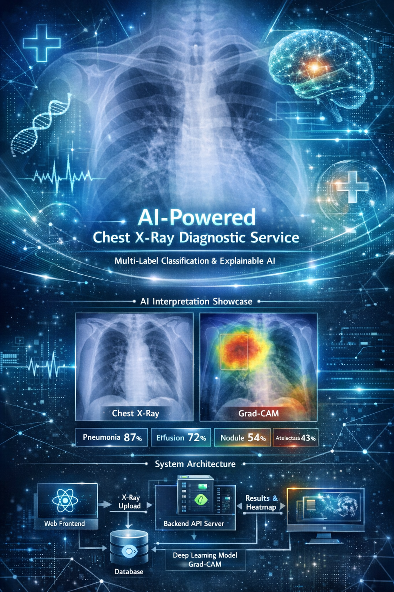
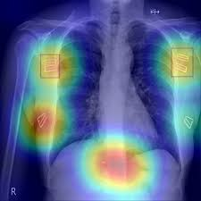
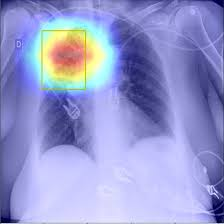

  

# 🩻 capstone-cxr

### AI-powered Chest X-ray Assistive Service  
의료 영상 기반 흉부 X-ray 진단 보조 서비스를 위한 캡스톤 통합 저장소

---

## ✨ Overview

> Chest X-ray 기반 멀티라벨 분류와 Grad-CAM 시각화를 결합하여  
> 의료진의 판독을 보조하는 풀스택형 AI 서비스를 목표로 합니다.

  

---

## 🔬 CXR + Grad-CAM Showcase

  실제 흉부 X-ray와 설명 가능성 시각화를 함께 제시하여  
  모델의 판단 근거를 직관적으로 확인할 수 있도록 설계합니다.

 

  
  
  

---

## 🧠 Core Features

- Multi-label pathology classification for chest X-ray
- Explainable AI visualization with Grad-CAM
- Backend-integrated AI inference service
- Frontend dashboard for image upload and result visualization
- Result storage and retrieval for practical workflow demonstration

---

## 🏗️ System Architecture

  

---

## 👥 Capstone Team

<table align="center">
  <tr>
    <td align="center" width="180">
      <a href="https://github.com/seyeonh">
          
        <b>손세연</b>
      </a>
       
      Frontend
        
      
    </td>
    <td align="center" width="180">
      <a href="https://github.com/Laplace-tech">
          
        <b>박용민</b>
      </a>
       
      AI
        
      
    </td>
    <td align="center" width="180">
      <a href="https://github.com/HOSUNG-07">
          
        <b>송호성</b>
      </a>
       
      Backend
        
      
    </td>
  </tr>
  <tr>
    <td align="center" width="180">
      <a href="https://github.com/Whale2357">
          
        <b>이용준</b>
      </a>
       
      Backend
        
      
    </td>
    <td align="center" width="180">
      <a href="https://github.com/bagjiwon">
          
        <b>박지원</b>
      </a>
       
      Frontend
        
      
    </td>
    <td align="center" width="180">
      <a href="https://github.com/zuxzae">
          
        <b>하윤진</b>
      </a>
       
      AI
        
      
    </td>
  </tr>
</table>