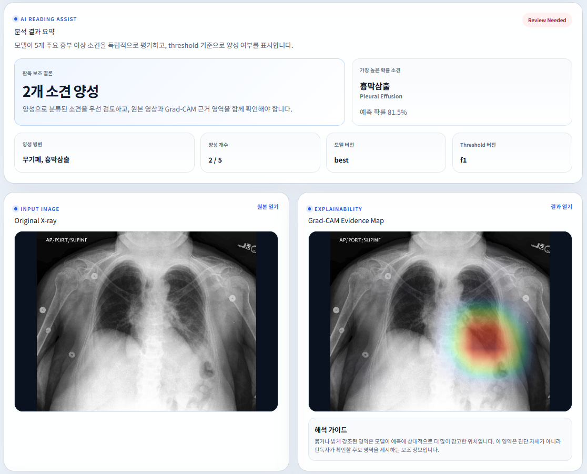
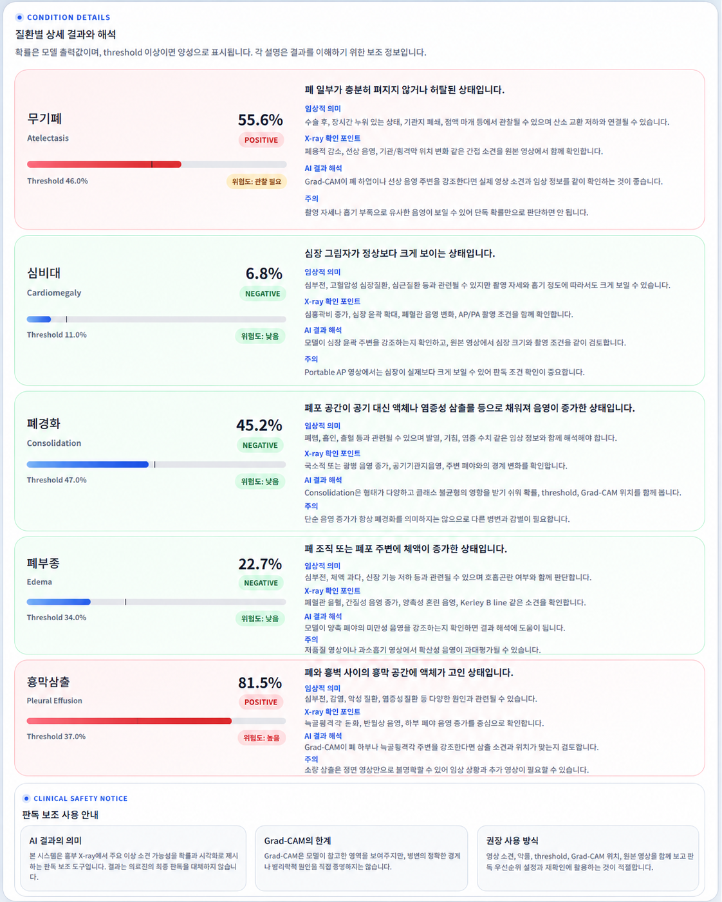

# MediScope · Chest X-ray Reading Assist System

> DenseNet121 기반 흉부 X-ray 다중 라벨 예측과 Grad-CAM 시각화를 결합한 판독 보조 웹 서비스 프로토타입입니다.

<br />

## Team & Ownership

<table>
  <tr>
    <td align="center" width="33%">
      <a href="https://github.com/zuxzae">
        
      </a>
      <h3>하윤진</h3>
      <b>Frontend Lead</b><br />
      <sub>React/Vite UI · Upload Flow · Result Dashboard · Product UX</sub><br /><br />
      <a href="https://github.com/zuxzae">
        
      </a>
    </td>
    <td align="center" width="33%">
      <a href="https://github.com/Laplace-tech">
        
      </a>
      <h3>박용민</h3>
      <b>Team Leader · AI Lead</b><br />
      <sub>Project Leadership · DenseNet121 Pipeline · AI Service · Grad-CAM · Experiments</sub><br /><br />
      <a href="https://github.com/Laplace-tech">
        
      </a>
    </td>
    <td align="center" width="33%">
      <a href="https://github.com/HOSUNG-07">
        
      </a>
      <h3>송호성</h3>
      <b>Backend Lead</b><br />
      <sub>Spring Boot API · Analysis Lifecycle · DB/API Integration · AI Service Bridge</sub><br /><br />
      <a href="https://github.com/HOSUNG-07">
        
      </a>
    </td>
  </tr>
  <tr>
    <td align="center" width="33%">
      <a href="https://github.com/Whale2357">
        
      </a>
      <h3>이용준</h3>
      <b>Backend / Integration Contributor</b><br />
      <sub>Backend Feature Support · Integration Testing</sub><br /><br />
      <a href="https://github.com/Whale2357">
        
      </a>
    </td>
    <td align="center" width="33%">
      <a href="https://github.com/bagjiwon">
        
      </a>
      <h3>박지원</h3>
      <b>AI / Research Contributor</b><br />
      <sub>Model Experiment Support · Paper/Evaluation Support</sub><br /><br />
      <a href="https://github.com/bagjiwon">
        
      </a>
    </td>
    <td align="center" width="33%">
      <a href="https://github.com/seyeonh">
        
      </a>
      <h3>손세연</h3>
      <b>Frontend / Product Contributor</b><br />
      <sub>UI Support · Product Documentation · Presentation Assets</sub><br /><br />
      <a href="https://github.com/seyeonh">
        
      </a>
    </td>
  </tr>
</table>

<br />

## Project Snapshot

| Area | Description |
|---|---|
| Service | Chest X-ray reading assistance prototype |
| Model | DenseNet121 multi-label classifier |
| Explainability | Grad-CAM evidence map |
| Target Findings | Atelectasis, Cardiomegaly, Consolidation, Edema, Pleural Effusion |
| Stack | React/Vite · Spring Boot · FastAPI · PostgreSQL · Docker Compose |

<br />

## System Architecture

<p align="center">
  
</p>

<br />

## Product Screenshots

### Result Summary & Grad-CAM

<p align="center">
  
</p>

### Condition Details

<p align="center">
  
</p>

<br />

## Research Artifacts

| Type | File |
|---|---|
| Paper | [`docs/research/mediscope-kit-2026-paper.hwp`](docs/research/mediscope-kit-2026-paper.hwp) |
| Presentation | [`docs/research/mediscope-final-presentation.pptx`](docs/research/mediscope-final-presentation.pptx) |

<br />

## Repository Structure

```text
capstone-cxr/
├── apps/
│   ├── frontend/        # React/Vite client
│   ├── backend/         # Spring Boot API server
│   └── ai-service/      # FastAPI inference service
├── docs/
│   ├── api/
│   ├── assets/
│   ├── product/
│   └── research/
├── infra/compose/       # Docker Compose
├── shared/              # local uploads/generated artifacts
└── README.md
```

<br />

## Run Locally

```bash
cd ~/projects/capstone-cxr

docker compose -f infra/compose/docker-compose.dev.yml up -d
```

Health check:

```bash
curl -i http://localhost:8000/health
curl -i http://localhost:8000/version
curl -i http://localhost:8080/api/hello
curl -I http://localhost:5173
```

Frontend:

```text
http://localhost:5173
```

<br />

## Development Mode

For frontend-heavy work, keep backend/AI/database in Docker and run the frontend locally.

```bash
cd ~/projects/capstone-cxr

docker compose -f infra/compose/docker-compose.dev.yml up -d postgres backend ai-service
```

```bash
cd apps/frontend
npm install
npm run dev
```

<br />

## Notice

This repository is an academic capstone and research prototype. It is not intended for autonomous clinical diagnosis.

