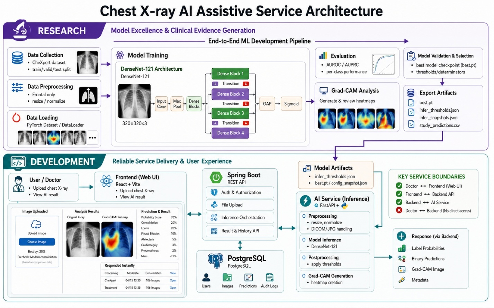
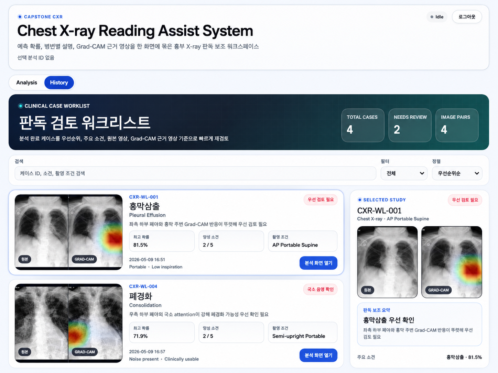

<p align="center">
  
</p>

<div align="center">


<br />


</div>

<br />

---

<br />

<div align="center">


</div>

<br />

<div align="center">

| <div align="center">하윤진</div> | <div align="center">박용민</div> | <div align="center">송호성</div> |
|:---:|:---:|:---:|
| <div align="center"><a href="https://github.com/zuxzae"></a></div> | <div align="center"><a href="https://github.com/Laplace-tech"></a></div> | <div align="center"><a href="https://github.com/HOSUNG-07"></a></div> |
| <div align="center"></div> | <div align="center"><br /><br /></div> | <div align="center"></div> |
| <div align="center"><b>React/Vite UI</b><br />Upload Flow<br />Result Dashboard<br />Product UX</div> | <div align="center"><b>Project Direction</b><br /><b>AI Architecture</b><br /><b>Core Inference Pipeline</b><br />DenseNet121 Training · Grad-CAM<br />AI Service Integration · Demo Readiness</div> | <div align="center"><b>Spring Boot API</b><br />Analysis Lifecycle<br />DB/API Integration<br />AI Service Bridge</div> |
| <div align="center"><a href="https://github.com/zuxzae"></a></div> | <div align="center"><a href="https://github.com/Laplace-tech"></a></div> | <div align="center"><a href="https://github.com/HOSUNG-07"></a></div> |

<br />

| <div align="center">손세연</div> | <div align="center">박지원</div> | <div align="center">이용준</div> |
|:---:|:---:|:---:|
| <div align="center"><a href="https://github.com/seyeonh"></a></div> | <div align="center"><a href="https://github.com/bagjiwon"></a></div> | <div align="center"><a href="https://github.com/Whale2357"></a></div> |
| <div align="center"></div> | <div align="center"></div> | <div align="center"></div> |
| <div align="center"><b>UI Support</b><br />Product Documentation<br />Presentation Assets</div> | <div align="center"><b>Model Experiment Support</b><br />Paper / Evaluation Support<br />Research Support</div> | <div align="center"><b>Backend Feature Support</b><br />Integration Testing<br />Service Flow Support</div> |
| <div align="center"><a href="https://github.com/seyeonh"></a></div> | <div align="center"><a href="https://github.com/bagjiwon"></a></div> | <div align="center"><a href="https://github.com/Whale2357"></a></div> |

</div>

<br />

---

<br />

<div align="center">

## MediScope · Chest X-ray Reading Assist System

DenseNet121 기반 흉부 X-ray 다중 라벨 예측과 Grad-CAM 시각화를 결합한 흉부 X-ray 판독 보조 웹 서비스

<br />


</div>

<br />

---

<br />

## Project Snapshot

| Area | Description |
|---|---|
| Service | Chest X-ray reading assistance system |
| Model | DenseNet121 multi-label classifier |
| Explainability | Grad-CAM evidence map |
| Target Findings | Atelectasis, Cardiomegaly, Consolidation, Edema, Pleural Effusion |
| Main Outcome | U-Ignore selected as the representative uncertainty policy |
| Deployment Form | React/Vite + Spring Boot + FastAPI + PostgreSQL + Docker Compose |
| Research PoC | [CheXpert Experiment Repository](https://github.com/Laplace-tech/CheXpert) |

<br />

## Repository Relationship

This project is split into two repositories with different responsibilities.

| Repository | Role | Description |
|---|---|---|
| [`capstone-cxr`](https://github.com/Laplace-tech/capstone-cxr) | Product / Service Repository | React, Spring Boot, FastAPI, PostgreSQL, Docker Compose 기반의 웹 서비스 구현 레포 |
| [`CheXpert`](https://github.com/Laplace-tech/CheXpert) | Research / Model PoC Repository | CheXpert-small 기반 DenseNet121 학습, 평가, threshold tuning, Grad-CAM 실험 레포 |

`CheXpert` is the research and experiment repository where the model pipeline was trained and evaluated.  
`capstone-cxr` is the service repository where the selected model artifacts and inference flow are integrated into a web-based reading assistance system.

```text
CheXpert
  └─ model training
  └─ uncertainty policy comparison
  └─ AUROC / AUPRC evaluation
  └─ F1 threshold tuning
  └─ Grad-CAM validation
        ↓ selected model artifacts and inference logic
capstone-cxr
  └─ React frontend
  └─ Spring Boot backend
  └─ FastAPI AI service
  └─ PostgreSQL
  └─ Docker Compose
```

> The two repositories are separated for clarity:  
> **CheXpert = research evidence**, **capstone-cxr = service implementation**.

<br />

## System Architecture

<p align="center">
  
</p>

<br />

## Web Demo

<p align="center">
  
</p>

<p align="center">
  <sub>Main web demonstration screen showing the clinical case worklist, selected study preview, prediction summary, and Grad-CAM evidence map.</sub>
</p>

<div align="center">

[](docs/assets/web/mediscope-full-analysis-detail.png)
[](docs/assets/web/mediscope-case-worklist-selected-study.png)

</div>

<br />

### 2026 한국정보기술학회 하계 종합학술대회 · 대학생 부문

| Item | Details |
|---|---|
| Conference | 2026 한국정보기술학회 하계 종합학술대회 |
| Division | 대학생 부문 |
| Research Field | Deep Learning |
| Authors | 박용민(제1저자), 박지원, 송호성, 이용준, 하윤진, 손세연, 임현기(지도교수) |
| Affiliation | 경기대학교 AI컴퓨터공학부 |
| Advisor | 임현기 교수 |

<br />

## Academic Output

<div align="center">

[](docs/assets/research/paper-cover.png)

</div>

The conference paper cover image is stored as an asset file instead of being displayed inline.

- Asset: [`docs/assets/research/paper-cover.png`](docs/assets/research/paper-cover.png)

<br />

## Model Development Reference

The model development process is documented in the separate CheXpert PoC repository.

- Repository: [Laplace-tech/CheXpert](https://github.com/Laplace-tech/CheXpert)
- Dataset: CheXpert-small
- Backbone: DenseNet121
- Task: Multi-label classification
- Target labels: Atelectasis, Cardiomegaly, Consolidation, Edema, Pleural Effusion
- Metrics: AUROC, AUPRC
- Thresholding: F1-based class-specific threshold tuning
- Explainability: Grad-CAM visualization

The representative model used in this service was selected from the CheXpert PoC experiments.  
Model checkpoints, raw datasets, logs, and generated experiment outputs are intentionally excluded from this service repository.

<br />

## Repository Structure

```text
capstone-cxr/
├── apps/
│   ├── frontend/        # React/Vite client
│   ├── backend/         # Spring Boot API server
│   └── ai-service/      # FastAPI inference service
├── docs/
│   ├── api/
│   ├── assets/
│   │   ├── architecture/
│   │   ├── presentation/
│   │   ├── research/
│   │   └── web/
│   ├── product/
│   └── research/
├── infra/compose/       # Docker Compose
├── shared/              # local uploads/generated artifacts
└── README.md
```

<br />

## Run Locally

```bash
cd ~/projects/capstone-cxr

docker compose -f infra/compose/docker-compose.dev.yml up -d
```

### Health Check

```bash
curl -i http://localhost:8000/health
curl -i http://localhost:8000/version
curl -i http://localhost:8080/api/hello
curl -I http://localhost:5173
```

### Local URLs

```text
Frontend   : http://localhost:5173
Backend    : http://localhost:8080
AI Service : http://localhost:8000
```

<br />

## Development Mode

For frontend-heavy work, keep backend/AI/database in Docker and run the frontend locally.

```bash
cd ~/projects/capstone-cxr
docker compose -f infra/compose/docker-compose.dev.yml up -d postgres backend ai-service
```

```bash
cd apps/frontend
npm install
npm run dev
```

<br />

## Notice

This repository is an academic capstone project for chest X-ray reading assistance. It is not intended for autonomous clinical diagnosis.

<br />

<p align="center">
  
</p>
