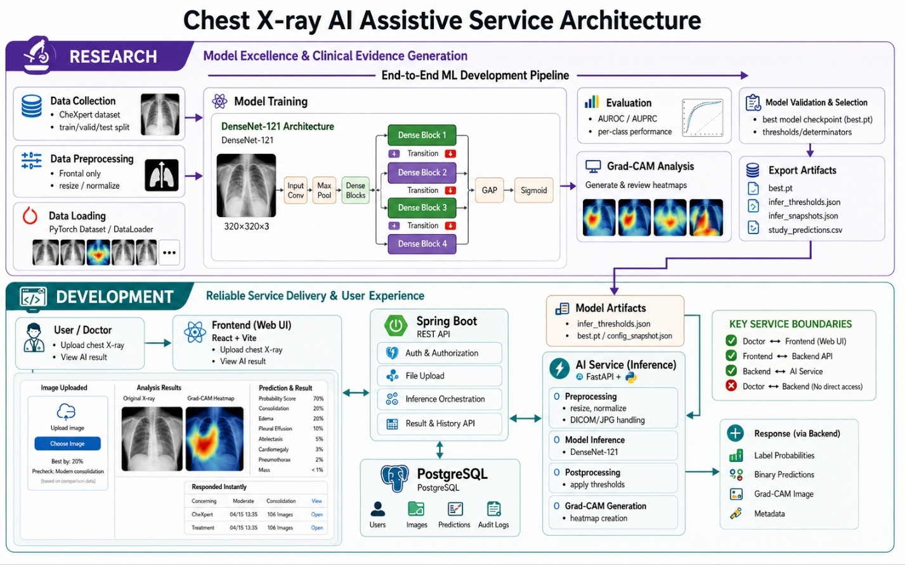
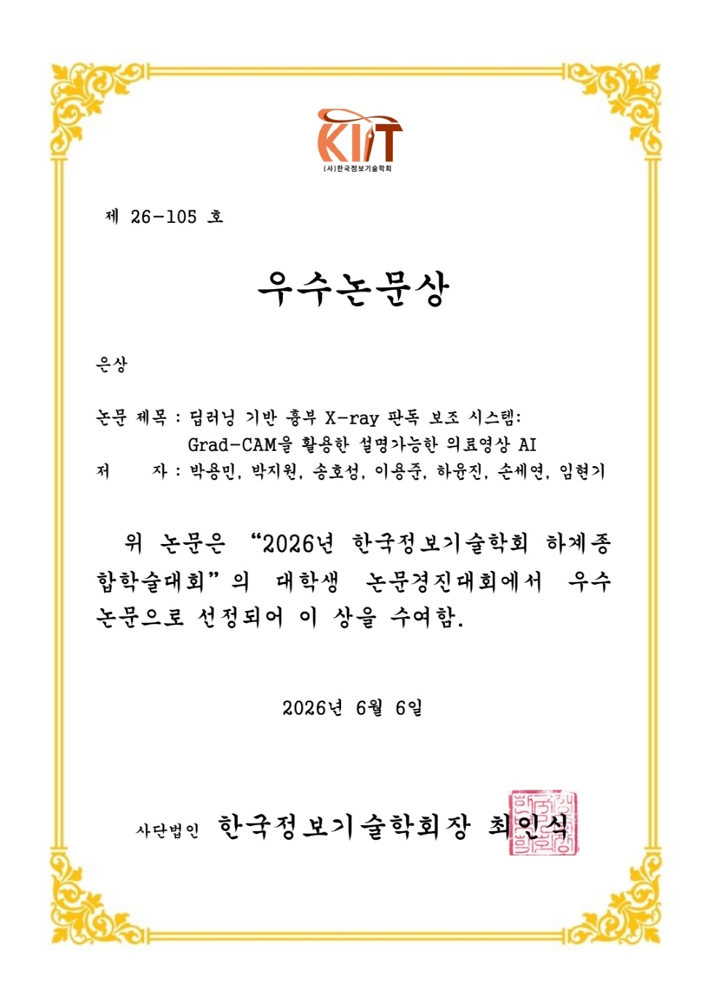

<p align="center">
  
</p>

<div align="center">


<br />


</div>

<br />

---

<br />

<div align="center">


</div>

<br />

<div align="center">

| <div align="center">하윤진</div> | <div align="center">박용민</div> | <div align="center">송호성</div> |
|:---:|:---:|:---:|
| <div align="center"><a href="https://github.com/zuxzae"></a></div> | <div align="center"><a href="https://github.com/Laplace-tech"></a></div> | <div align="center"><a href="https://github.com/HOSUNG-07"></a></div> |
| <div align="center"></div> | <div align="center"><br /></div> | <div align="center"></div> |
| <div align="center"><b>React/Vite UI</b><br />Upload Flow<br />Result Dashboard<br />Product UX</div> | <div align="center"><b>Project Management</b><br /><b>AI Research Pipeline Design</b><br /><b>Fine-Tuning & Model Selection</b><br />Model Inference Serving<br /></div> | <div align="center"><b>Spring Boot API</b><br />Analysis Lifecycle<br />DB/API Integration<br />AI Service Bridge</div> |
| <div align="center"><a href="https://github.com/zuxzae"></a></div> | <div align="center"><a href="https://github.com/Laplace-tech"></a></div> | <div align="center"><a href="https://github.com/HOSUNG-07"></a></div> |

<br />

| <div align="center">손세연</div> | <div align="center">박지원</div> | <div align="center">이용준</div> |
|:---:|:---:|:---:|
| <div align="center"><a href="https://github.com/seyeonh"></a></div> | <div align="center"><a href="https://github.com/bagjiwon"></a></div> | <div align="center"><a href="https://github.com/Whale2357"></a></div> |
| <div align="center"></div> | <div align="center"></div> | <div align="center"></div> |
| <div align="center"><b>UI Support</b><br />Product Documentation<br />Presentation Assets</div> | <div align="center"><b>Model Experiment Support</b><br />Paper / Evaluation Support<br />Research Support</div> | <div align="center"><b>Backend Feature Support</b><br />Integration Testing<br />Service Flow Support</div> |
| <div align="center"><a href="https://github.com/seyeonh"></a></div> | <div align="center"><a href="https://github.com/bagjiwon"></a></div> | <div align="center"><a href="https://github.com/Whale2357"></a></div> |

</div>

<br />

---

<br />

## Project Snapshot

Client-side Chest X-ray upload부터 Server-side의 model inference, result persistence,
Grad-CAM visualization까지, DenseNet121 backbone으로 직접 학습한 model을 하나의
end-to-end service workflow로 연결한 academic prototype.

| Area | Description |
|---|---|
| Program | 경기대학교 AI컴퓨터공학부 2026 기초캡스톤디자인 경진대회 |
| Service | CNN-based Chest X-ray reading assistance system |
| Development Period | 2026.03 – 2026.05 |
| Research Task | Multi-label classification of Chest X-ray findings |
| Model | DenseNet121 multi-label classifier |
| Target Findings | Atelectasis · Cardiomegaly · Consolidation · Edema · Pleural Effusion |
| Explainability | Prediction evidence visualization with Grad-CAM |
| Service Stack | React/Vite · Spring Boot · FastAPI · PostgreSQL · Docker Compose |
| Main Outcome | U-Ignore selected as the representative uncertainty-label policy |

<br />


## System Architecture

<p align="center">
  
</p>

<br />

## Research-to-Service Pipeline

Model research와 Service implementation을 별도의 repository로 분리하여
experiment history와 product code의 책임을 명확히 구분하여 진행하였다.

| Repository | Role | Description |
|---|---|---|
| [`CheXpert`](https://github.com/Laplace-tech/CheXpert) | Research / Model PoC | Model training, evaluation, threshold tuning, Grad-CAM validation |
| [`capstone-cxr`](https://github.com/Laplace-tech/capstone-cxr) | Product / Service | Selected model artifacts와 inference flow를 통합한 web application |

### Model Development

CheXpert PoC에서 uncertainty policy와 class-specific threshold를 비교한 뒤,
최종 선정한 model artifact와 inference logic만 MediScope service에 통합시켰다.

```text
CheXpert Research PoC
        ↓ selected model artifacts and inference logic
MediScope Service
```

> 구체적인 experiment setup과 model training·validation,
> uncertainty-label policy 비교, metrics evaluation, threshold tuning 적용 과정은
> [CheXpert Research PoC](https://github.com/Laplace-tech/CheXpert)를 참고.

<br />

## Award & Academic Output

### 2026 한국정보기술학회 하계종합학술대회 · 대학생 부문 논문경진대회

| Item | Details |
|---|---|
| Award | 우수논문상 (은상) |
| Conference | 2026 한국정보기술학회 하계종합학술대회 · 대학생 논문경진대회 |
| Research Field | Deep Learning · Medical Imaging AI |
| Paper Title | 딥러닝 기반 흉부 X-ray 판독 보조 시스템: Grad-CAM을 활용한 설명가능한 의료영상 AI |
| Authors | 박용민 (First Author), 박지원, 송호성, 이용준, 하윤진, 손세연, 임현기 |
| Affiliation | 경기대학교 AI컴퓨터공학부 |
| Advisor | 경기대학교 임현기 교수 |
| Date | 2026.06.06 |

<br />

The conference paper cover and award certificate are stored as repository assets.

- Paper cover: [`docs/assets/research/paper-cover.png`](docs/assets/research/paper-cover.png)
- Award certificate PDF: [`docs/assets/awards/kiit-2026-summer-silver-award.pdf`](docs/assets/awards/kiit-2026-summer-silver-award.pdf)

<br />

<details>
<summary><b>View Award Certificate Preview</b></summary>

<br />

<p align="center">
  
</p>

</details>

<br />

## Repository Structure

```text
capstone-cxr/
├── apps/
│   ├── frontend/        # React/Vite client
│   ├── backend/         # Spring Boot API server
│   └── ai-service/      # FastAPI inference service
├── docs/
│   ├── api/
│   ├── assets/
│   │   ├── architecture/
│   │   ├── awards/
│   │   ├── presentation/
│   │   ├── research/
│   │   └── web/
│   ├── product/
│   └── research/
├── infra/
│   └── compose/         # Docker Compose
├── shared/              # local uploads/generated artifacts
└── README.md
```

<br />

## Run Locally

```bash
cd ~/projects/capstone-cxr

docker compose -f infra/compose/docker-compose.dev.yml up -d
```

### Health Check

```bash
curl -i http://localhost:8000/health
curl -i http://localhost:8000/version
curl -i http://localhost:8080/api/hello
curl -I http://localhost:5173
```

### Local URLs

```text
Frontend   : http://localhost:5173
Backend    : http://localhost:8080
AI Service : http://localhost:8000
```

<br />

## Development Mode

For frontend-focused development, run PostgreSQL, backend, and AI service in Docker while running the frontend locally.

```bash
cd ~/projects/capstone-cxr
docker compose -f infra/compose/docker-compose.dev.yml up -d postgres backend ai-service
```

```bash
cd apps/frontend
npm install
npm run dev
```

<br />

## Notice

This repository is intended for academic research and demonstration purposes only.

It is not intended for autonomous clinical diagnosis or medical decision-making.

<br />

<p align="center">
  
</p>
